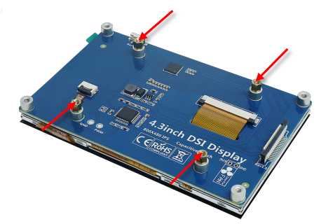
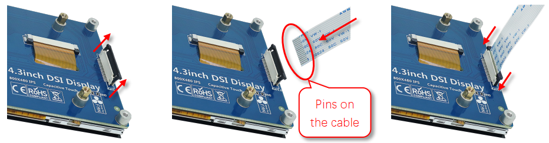
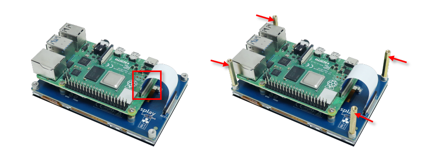
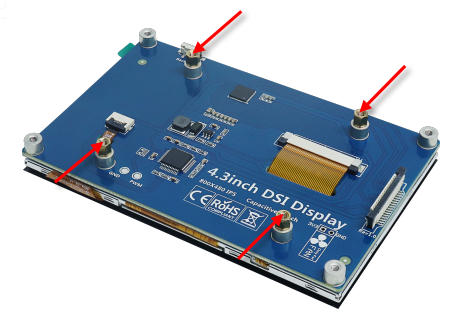
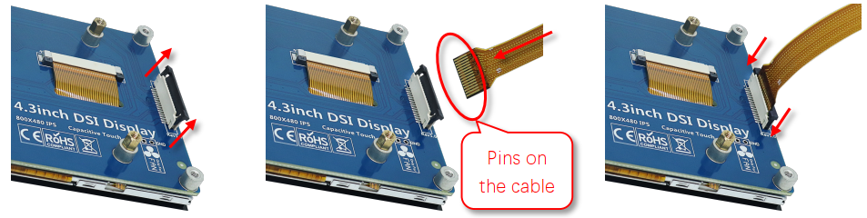
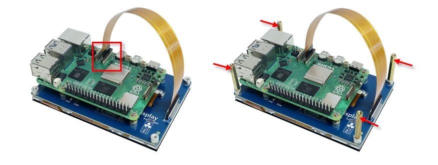

##########################################
Tutorial 4.3 inch
##########################################

For Raspberry Pi 4 and Previous
*****************************************

Please note that your screen may differ from the images below due to variations in the models.

1. Install the OS for your Raspberry Pi. (Please refer to the Raspberry Pi website.)

2. Install 4 short brass standoffs.

3. Connect the ribbon cable.
   
.. note::
    
    Pay attention to the pins on the cable when connecting

4. Fix the Raspberry Pi with 4 screws and then connect the ribbon cable. Then install 4 long brass standoffs.

5. Power up the Raspberry Pi and wait for a few seconds, the screen will display.

:red:`Having problems?` Download the latest tutorial and troubleshooting: http://freenove.com/fnk0078

Need further help? Contact our technical support by email: support@freenove.com

For Raspberry Pi 5
*****************************************

Please note that your screen may differ from the images below due to variations in the models.

1. Install the OS for your Raspberry Pi. (Please refer to the Raspberry Pi website.)

2. Install 4 short brass standoffs.

3. Connect the ribbon cable.
   
.. note::
    
    Pay attention to the pins on the cable when connecting.

4. Fix the Raspberry Pi with 4 screws and then connect the ribbon cable. Then install 4 long brass standoffs.

5. Power up the Raspberry Pi and wait for a few seconds, the screen will display.

:red:`Having problems?` Download the latest tutorial and troubleshooting: http://freenove.com/fnk0078

Need further help? Contact our technical support by email: support@freenove.com