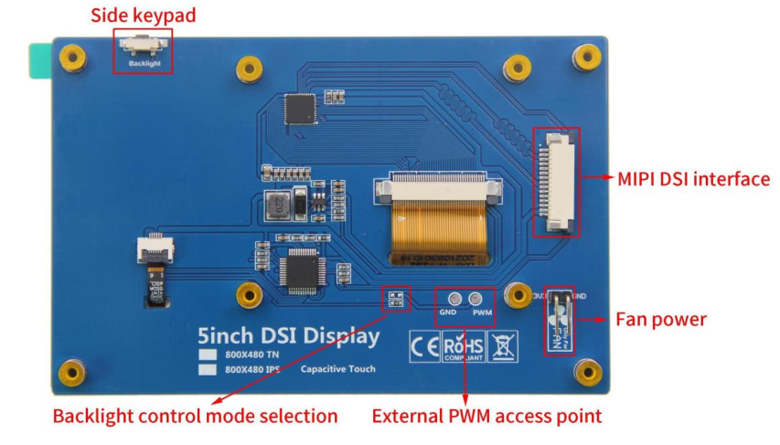
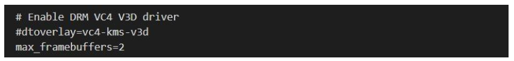
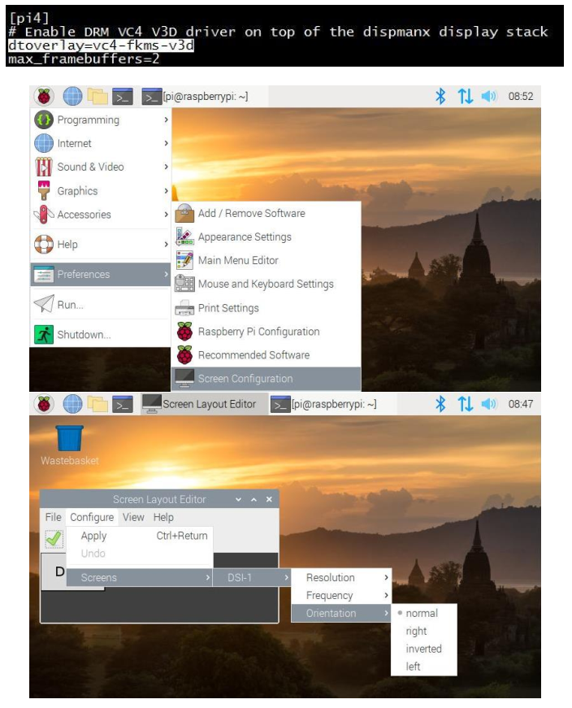
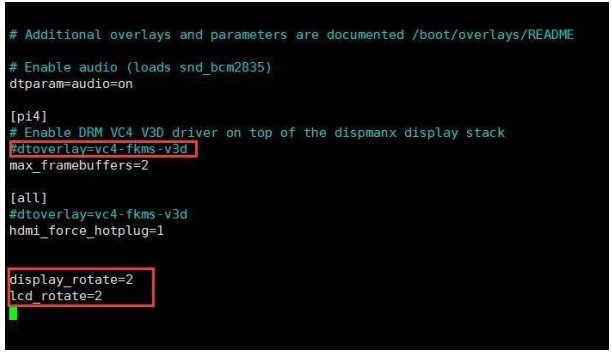
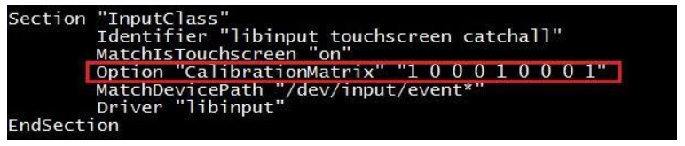

##########################################
Frequently Asked Questions
##########################################

How to adjust Backlight Brightness
*******************************************

Method 1: Adjust by pressing buttons
===========================================

Click the side keypad to increase by 10%, then return to 10% after reaching 100%; Long press to turn off

the backlight and press again to restore the original brightness.

Method 2: Adjust by entering a command
===========================================

1. Find the **'dtoverlay=vc4-kms-v3d'** in the /boot/config.txt file and comment it out
   
'#dtoverlay=vc4-kms-v3d'.)

2. Permission needs to be granted first (only need to run once after each boot):

.. code-block:: console

    sudo chmod 777 /sys/class/backlight/rpi_backlight/brightness

3. Next step:

.. code-block:: console

    echo X > /sys/class/backlight/rpi_backlight/brightness

'X' indicates any number from 0 to 255. 0 indicates the darkest backlight, and 255 indicates the brightest backlight

(In this way, the brightness adjustment will be recorded in the system and will still take effect after the machine is restarted. The PWM mode is not recorded and changes with the signal in real time.)

How to change the direction of the screen?
**********************************************

There are two modes to rotate the display direction: FKMS mode and traditional graphics mode。

Method 1: FKMS mode
==========================================

FKMS mode is used by default on Raspberry Pi 4B.When using this mode, make sure that **dtoverlay=vc4-fkms-v3d”** under pi4 in **/boot/config.txt** file is not commented out. In this mode, the display direction can only be rotated by menu options. Note that when setting the display direction in the menu, it is recommended to use the mouse for operation.

Method 2: Traditional graphics mode
===========================================

By default, the Raspberry Pi 3, 2, and 1 series use traditional graphics mode. Raspberry Pi 4B can also use traditional graphics mode, just in **/boot/config.txt** file under the Pi 4:

.. code-block:: console

    dtoverlay=vc4-fkms-v3d

Comment out, as shown (Traditional graphics mode is generally not recommended on Raspberry Pi 4B).

In traditional graphics mode, this can be done by adding it at the end of the /boot/config.txt file:

.. code-block:: console

    display_lcd_rotate=x(x=0,1,2,3,0x10000,0x20000)

To set the display orientation, reboot is required to take effect.

.. code-block:: console

    display_lcd_rotate=0, the default normal display direction (no rotation);
    display_lcd_rotate=1, Rotate 90° clockwise;
    display_lcd_rotate=2, Rotate 180° clockwise;
    display_lcd_rotate=3, Rotate 270° clockwise;
    display_lcd_rotate=0x10000, Flip horizontal;
    display_lcd_rotate=0x20000, Flip vertical;

.. note::
    
    **There is a more convenient way to rotate display and touch at the same time by rotating 180° clockwise.**

Please find the 'dtoverlay=vc4-kms-v3d' in the /boot/config.txt file and comment it out '#dtoverlay=vc4-ms-v3d', and add the following statement at the end of the file

.. code-block:: console

    display_rotate=2
    lcd_rotate=2

After saving and restart, display and touch can be used normally (only rotate 180°, other directions are not applicable)

How to rotate the touch direction?
*******************************************

The display direction is set, and the touch direction should be set accordingly. It needs to correspond with the display direction; otherwise the touch operation is not accurate. Touch direction setting need to be in the

/usr/share/X11/xorg.conf.d/40-libinput.conf file add '<Option" CalibrationMatrix " "XXX" > content, including XXX for touch direction set parameters, the following will show.

Open the 40-libinput.conf file:

.. code-block:: console

    sudo nano /usr/share/X11/xorg.conf.d/40-libinput.conf

After the modification, press **Ctrl +X, Y**, and **Enter** to save and exit.

**Corresponding relation table of display direction and touch direction:**

+-----------------------+----------+----------------------------+--------------------------------------------------+
|Display                |FKMS      |Traditional graphics        |Touch orientation                                 |
|                       |          |                            |                                                  |
|Rotation               |mode      |mode Settings               |setting                                           |
+=======================+==========+============================+==================================================+
| no rotation           | normal   | display_lcd_rotate=0       | Option "CalibrationMatrix" "1 0 0 0 1 0 0 0 1"   |
+-----------------------+----------+----------------------------+--------------------------------------------------+
| Rotate 90° clockwise  | right    | display_lcd_rotate=1       | Option "CalibrationMatrix" "0 1 0 -1 0 1 0 0 1"  |
+-----------------------+----------+----------------------------+--------------------------------------------------+
| Rotate 180° clockwise | inverted | display_lcd_rotate=2       | Option "CalibrationMatrix" "-1 0 1 0 -1 1 0 0 1" |
+-----------------------+----------+----------------------------+--------------------------------------------------+
| Rotate 270° clockwise | left     | display_lcd_rotate=3       | Option "CalibrationMatrix" "0 -1 1 1 0 0 0 0 1"  |
+-----------------------+----------+----------------------------+--------------------------------------------------+
| Flip horizontal       | NO       | display_lcd_rotate=0x10000 | Option "CalibrationMatrix" "-1 0 1 0 1 0 0 0 1"  |
+-----------------------+----------+----------------------------+--------------------------------------------------+
| Flip vertical         | NO       | display_lcd_rotate=0x20000 | Option "CalibrationMatrix" "1 0 0 0 -1 1 0 0 1"  |
+-----------------------+----------+----------------------------+--------------------------------------------------+